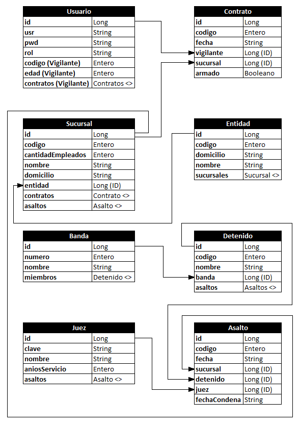

# Policia Federal Argentina

Sistema desarrollado para el final de la asignatura Programación 2, del Instituto Nacional Superior del Profesorado Técnico - Universidad Tecnológica Nacional.  
Esta aplicación fue diseñada con una arquitectura de API RESTful que permite ser consumida por un frontend web. Para el Backend se utilizó Java con Hibernate como ORM para MySQL y Spark Framework como microframework para gestionar las rutas, mientras que para el frontend se utilizó ReactJS. Algunas de las dependencias utilizadas fueron:
- Lombok (para reducir el código *boilerplate*)
- Gson (para poder manipular JSON en Java)
- JWT (para manejar el login, tanto en el front como en el back)
- Axios (para realizar las solicitudes del front al back, en lugar de utilizar la API de Fetch)
- AntDesign (para los componentes del front)

## Diagramas de casos de uso

### Vigilante

### Investigador

### Administrador

## Entidades

## Consigna

Desarrolle un sistema para gestionar la información de la Policía Federal sobre la seguridad en algunas entidades bancarias, teniendo en cuenta que:                    
- Cada entidad bancaria se caracteriza por un código y por el domicilio de su Central.
- Cada entidad bancaria tiene más de una sucursal que también se caracteriza por un código y por el domicilio, así como por el número de empleados de dicha sucursal.
- Cada sucursal contrata, según el día, algunos vigilantes, que se caracterizan por un código y su edad. Un vigilante puede ser contratado por diferentes sucursales (incluso de diferentes entidades), en distintas fechas y es un dato de interés dicha fecha, así como si se ha contratado con arma o no.
- Por otra parte, se quiere controlar a las personas que han sido detenidas por asaltar las sucursales de dichas entidades. Estas personas se definen por una clave (código) y su nombre completo.
- Alguna de estas personas están integradas en algunas bandas organizadas y por ello se desea saber a qué banda pertenecen, sin ser de interés si la banda ha participado en el delito o no. Dichas bandas se definen por un número de banda y por el número de miembros.
- Asimismo, es interesante saber en qué fecha ha asaltado cada persona una sucursal. Evidentemente, una persona puede asaltar varias sucursales en diferentes fechas, así como una sucursal puede ser asaltada por varias personas.
- Igualmente, se quiere saber qué juez ha estado encargado del caso, sabiendo que un individuo, por diferentes delitos, puede ser juzgado por diferentes jueces. Es de interés saber, en cada delito, si la persona detenida ha sido condenada o no, y de haberlo sido, cuánto tiempo pasó o pasará en la cárcel. Un juez se caracteriza por una clave interna del juzgado, su nombre y los años de servicio.
- En ningún caso interesa saber si un vigilante ha participado en la detención de un asaltante.
- Al sistema podrán acceder tres tipos de usuarios:                            
  - vigilantes (que sólo podrán consultar sus datos)
  - investigadores (que podrán consultar todo)
  - administradores (que administrarán todo)